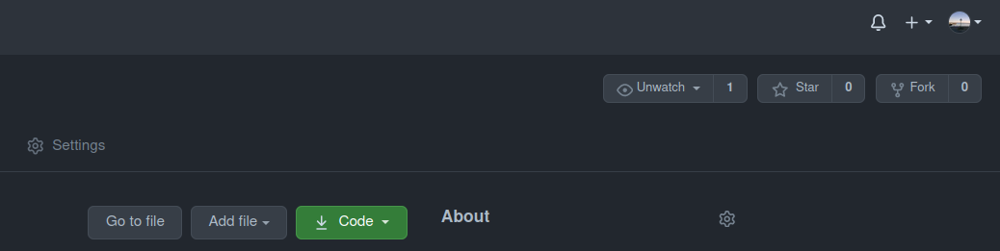

# Code Kata Decorators

In this code kata we will discuss `python` decorators in some detail. Besides that we will
use a further way to collaborate on code projects and briefly touch exceptions.

## Useful Material on Decorators

### Websites and Blogs:
* [Python Decorators Introduction @pythonbasics.org](https://pythonbasics.org/decorators/)
* [Decorators in Python [Explained] by Sumeet Singh@askpython.com](https://www.askpython.com/python/examples/decorators-in-python)
* [Primer on Python Decorators by Geir Arne Hjelle@realpython.com](https://realpython.com/primer-on-python-decorators/)
* [PEP 318 -- Decorators for Functions and Methods](https://www.python.org/dev/peps/pep-0318/)

### Talks
* [Python Decorators by Jonathan Fernandes@linkedIn Learning](https://www.linkedin.com/learning/python-decorators)
* [Decorators, unwrapped How do they work by Katie Silverio@PyCon 2017](https://youtu.be/UBSyD1RkOX0)
* [Practical decorators by Reuven M. Lerner@PyCon 2019](https://youtu.be/MjHpMCIvwsY)

## What Are Decorators

Decorators are a simple way to extend the behavior of functions, methods, or classes (i.e. callables) without modifying the functions, methods, or classes themselves, respectively. To understand how this is done, let us first recall that functions are first-class objects in Python. For instance, they can be used as arguments in functions
and also returned like any other object, or serve as values in dictionaries, e.g.
```python
import pandas as pd

read_from = {
    "pickle": pd.read_pickle,
    "parquet": pd.read_parquet,
    "csv": pd.read_csv,
}

df = read_from["csv"]("path/to/some/csv/file.csv")
```

In the case of decorators this property is exploited in the following way:
* First of all, the decorator is just a function itself.
* It takes the function we want to decorate as an argument.
* Then it defines a new function by hopefully making you of the function it got as an input
* Finally it returns the new function which can be called.

Let's give a little example. Let's say we have the function
```python
def say_my_name() -> None:
    print("John Doe")
```
which we want to decorate such that it does not only prints the name but a little context too. Hence, we define the decorator `friendly`:
```python
def friendly(func) -> Callable:
    def modified_function() -> None:
        print("Hello, my name is:")
        func()
    return modified_function
```
We can now apply the `friendly` decorator on the `say_my_name` function and obtain a new callable, i.e.
```python
friendly_name = friendly(say_my_name)

friendly_name()
```
Now, if we always wanted the `say_my_name` function to print out
```
Hello, my name is:
John Doe
```
we can just add the decorator with an `@` to the function definition of `say_my_name`
```python
@friendly
def say_my_name() -> None:
    print("John Doe")
```
because `@decorator` is "equivalent" to
```python
func = decorator(func)
```

### Template

Of course we can also decorate functions with arguments. The following template should give a good idea of how that is done.
```python
from functools import wraps

def decorator(func):
    @wraps(func)
    def wrapper(*args, **kwargs):
        # do something before
        result = func(*args, **kwargs)
        # do something after
        return result
    return wrapper


@decorator
def some_func():
    pass
```
If you are wondering about the `@wraps` decorator in front of the `wrapper` definition, then you noticed an interesting subtlety with decorators as we defined them so far. Because if we omit the `@wraps` decorator the doc string and name of decorated function would be of the one which is returned by the decorator. In this case, the doc string and name of `some_func` would be those of `wrapper`.

## Exercises

* In the first exercise you should write a decorator which logs the execution time of a function. The decorator should be called `log_execution_time` and has to be defined within the `exercises/exercises.py` file. 

* In the second part, you should define a decorator which catches the `Exception` (if raised) of a function, logs the exception message to `CRITICAL` and raise the `Exception` again. The name of the decorator has to be `catch_exception` and must also be defined in `exercises/exercises.py`. Although not really need---but in case you want to refresh your mind on it---the python doc on exceptions can be found [here](https://docs.python.org/3/library/exceptions.html#).

**Note**: if you are unsure about the exercise, please have also a look at the `tests/test_exercises.py` file.

## Test Solutions

To test your implementations of the solutions, please run
```
docker-compose run --rm test
```

## How to "Submit" the Solution

Like the last time, you will have to create a pull requests to hand in your solution. Again you should use the associated review process to discuss each others solution.

However, this time you have to first fork the repository, i.e. make a copy of it under your name space.

Then `git clone` from there and work on your solution. When you are done push to your repository and put out a pull request to the `main` branch of the original repo. Since you are working on a fork, `GitHub` will allow you to chose this option when you create the pull request.
